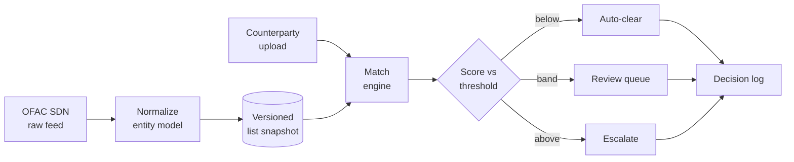

# Sanctions Screening Demo

Upload a counterparty file, screen it against the OFAC SDN list, and decide
where the auto-clear threshold sits. The app produces a *decision*, not a
search result: every screened row ends up cleared, routed to review, or
escalated, with the reason recorded in an exportable decision log.

## Architecture



- **Ingest** — flatten OFAC SDN into one entity model: canonical name, entity
  type, alias list (strong/weak), DOB as a range, country, list version.
- **Match** — exact match on normalized form plus Jaro-Winkler string
  distance, run as a batch score (`rapidfuzz.cdist`) against the watchlist.
- **Decide** — a threshold control that moves auto-clear/review/escalate
  volumes live, a review queue (manual or simulated), and a CSV export with
  list version, matched alias, score and reviewer per row.

## Running it

Backend (FastAPI):

```
uv sync
uv run uvicorn sanctions_screening.api.main:app --reload --port 8000
```

Frontend, for live development with hot reload (proxies `/api` to the
backend above):

```
cd frontend
npm install
npm run dev
```

`uvicorn` alone is also enough to demo the whole app: if `frontend/dist`
exists (`npm run build`), the backend serves it directly at `/` — no
separate frontend process needed.

## Data

The app ships with two, deliberately separate, kinds of data.

### Real data (what the app runs on)

`data/bundled/` is generated by `scripts/fetch_ofac_sdn.py`,
`scripts/fetch_gleif.py`, and `scripts/build_demo_data.py`, from two public
sources:

| Source | Role |
| --- | --- |
| OFAC SDN list (US Treasury) | The watchlist — real published names, aliases, entity types, partial DOBs |
| GLEIF LEI data (open, bulk download) | The clean population — real legal entity names, so negatives look like real counterparties |

Everything here is public data; no client material is involved.

**Ground truth.** `scripts/build_labelled_test_set.py` perturbs real OFAC
names into known positives (transliteration variants, typos, word-order
swaps, initials for given names, legal-suffix changes, added/stripped
diacritics) and salts them into the GLEIF negative population, keeping the
perturbation type per row. That labelled set (`data/bundled/labelled_test_set.jsonl`)
is what drives the live precision/recall readout in the UI. One caveat worth
stating rather than hiding: perturbations we invented are easier than
real-world messy data, so that curve is directional, not a benchmark.

### Synthetic data (fictional, for dev/testing)

`scripts/generate_synthetic_data.py` produces a wholly **fictional** dataset
into `synthetic-files/`: a fake watchlist shaped like OFAC's SDN CSV release
(main file + alias file), a fake counterparty upload, and a matching labels
file. No real names, entities, or sanctions programs — random combinations
from small name pools, with placeholder program codes. It exists so the
ingest/match code can be written and tested against SDN-shaped data before
wiring up the real feed, and so the repo has a shareable dataset that carries
no real watchlist data at all. Rerun with the same `SEED` (42) for
byte-identical output. It is not used by the running app, which loads
`data/bundled/` instead.

## Scope

v1 covers OFAC SDN only (ingest, normalize, match, decide), with a single
matcher (exact + Jaro-Winkler) and no authentication, real-time feed
refresh, or database beyond local files. Additional watchlists (UK OFSI, EU
consolidated) and an LLM adjudicator over the ambiguous band are designed
for, not built.
