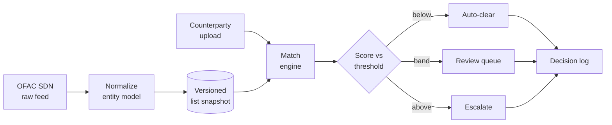

# Sanctions Screening Demo — Handover Notes

2026-09-20 · Anna

## What this is

A sanctions screening demo: upload a counterparty file, screen it against a public watchlist, and defend where the auto-clear threshold sits.

It is a portfolio piece, and it has to prove three things at once:

- **Integration** — ingest a real published list, on its real schema, and keep it versioned.
- **Data-quality judgment** — handle aliases, transliteration, partial dates and entity types without pretending they are clean.
- **Buyer-facing clarity** — a non-technical reviewer can move a slider and see the trade-off they are buying.

The design choice that carries all three: the app produces a *decision*, not a search result. Every screened row ends as cleared, routed to review, or escalated, with the reason recorded.

## Data sources

v1 uses two public sources and nothing else. Verify current endpoints and formats before building — these change.

| Source | Role in the build | Status |
| --- | --- | --- |
| OFAC SDN list (US Treasury) | The watchlist. Published as XML and CSV, includes aliases, entity types, addresses, partial DOBs | v1 |
| GLEIF LEI data (open, bulk download) | The clean population — real legal entity names to screen, so negatives look like real counterparties | v1 |
| UK OFSI consolidated list | Second schema for the same concept | Deferred |
| EU consolidated list | Third schema | Deferred |

The deferred lists are deferred on purpose. Adding them proves you can write another parser; it does not prove anything new about your judgment, and ingest will otherwise consume the whole build. Note them in the README as designed-for, not built.

Everything is public data. No client material.

## Architecture

Three stages, each carrying one of the three objectives.

**Ingest.** Flatten the feed into one entity model: canonical name, entity type (individual, company, vessel), alias list with strong/weak flag, date-of-birth as a range rather than a date, country, list version. The normalization decisions are the interesting part — case folding, punctuation, legal suffixes, transliteration variants — and each one should be a named, testable function, not buried in a script.

**Match.** Run several matchers and keep them separable so you can show what each contributes: exact on normalized form, token-set overlap, a string-distance measure such as Jaro-Winkler, and optionally an LLM adjudicator applied only to the ambiguous band. Output per candidate pair: score, which matcher fired, which alias it hit.

**Decide.** A threshold control that moves auto-clear and review volumes live, a review queue where a human clears or escalates, and an export showing list version, matched alias, rule, score and reviewer per row. The export is what makes it look like a product rather than a notebook.

## Ground truth

Without labelled data, any precision and recall figure on the demo is decoration. Generate the labels.

Take names from the SDN list and perturb them into known positives:

- Transliteration variants (Mohammed / Muhammad / Mohamad)
- Character-level typos and doubled letters
- Word order swaps and dropped middle names
- Initials in place of given names
- Legal-suffix changes (Ltd / Limited / LLC, or dropped entirely)
- Diacritics added or stripped

Salt those into a clean population drawn from GLEIF, which gives you known negatives that still look like plausible counterparties. Keep the perturbation type on each row — that lets you say which failure mode the matcher is weakest on, which is a much better interview answer than a single F1 number.

One caveat to state in the README rather than hide: perturbations you invented are easier than real-world data, so the curve is directional, not a benchmark. Saying that unprompted is part of what the project demonstrates.

## v1 scope

Ship this and stop:

- [ ] OFAC SDN ingest, normalized into the entity model, snapshot versioned
- [ ] One matcher plus exact match, with per-match reasons
- [ ] Perturbation harness and a labelled test set
- [ ] Threshold control with live precision, recall and review-volume readout
- [ ] Review queue with clear / escalate and a decision log export
- [ ] A 200-row demo file that loads on open, so the app is never empty

Explicit non-goals for v1: additional watchlists, real-time feed refresh, authentication and multi-user roles, fuzzy address or DOB matching, a database beyond local files. Each one is defensible in an interview as a scoping decision; none of them makes the demo more convincing.

## Open decisions

- [ ] Stack — a Python backend with a light frontend, or a single-page app with the matching in the browser? Browser-only makes the demo trivially shareable but caps list size.
- [ ] Whether the LLM adjudicator is in v1 at all. It is a differentiator for AI-adjacent roles and a reliability risk in a live demo. One option: run it offline over the ambiguous band and show the results, rather than calling it live.
- [ ] Whether the reviewer is simulated or you click through it yourself in the demo.
- [ ] Where it lives — GitHub only, or hosted so a recruiter can open it without cloning.

**Suggested first task:** the entity schema and the normalizer, with unit tests for each normalization rule. It is the load-bearing piece, and if the schema is wrong everything downstream gets rewritten.

**Second task:** the perturbation harness, before any matcher. Building the test set first stops you from tuning a matcher against a feeling.
